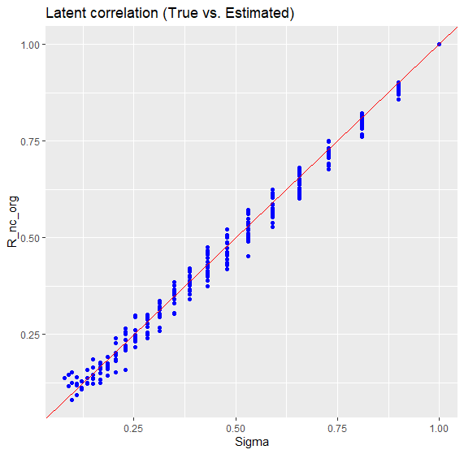

# Summary

The R package *latentcor* provides estimation for latent correlation with mixed data types (continuous, binary, truncated and ternary). Comparing to *MixedCCA*, which estimates latent correlation for canonical correlation analysis, our new package provides a standalone version for latent correlation estimation. Also we add new functionality for latent correlation between ternary/continous, ternary/binary, ternary/truncated and ternary/ternary cases.


Compare to MixedCCA, memory footprint.

# Statement of need

Currently there is no standalone package dealing with latent correlation for mixed data type like we did in *latentcor*. The R package *stats* [@team2013r] have some functionality to calculate different type of correlations (Pearson, Kendall and Spearman). The R package *polycor* [@fox2019poly] computes polycoric and polyserial correlations for ordinal data. The R package *pcaPP* [@croux2013robust] provides a fast calculation for Kendall's $\tau$. The R package *MixedCCA* [@yoon2020sparse] have functionality for latent correlation estimation as an intermediate step for canonical correlation analysis on mixed data.

# Usage
 
 |Type | continuous | binary | truncated | ternary |
|-----|----------|----------|----------|----------|
|continuous | @liu2009nonparanormal | @fan2017high | @yoon2020sparse | @quan2018rank |
|binary | @fan2017high | @fan2017high | @yoon2020sparse | @quan2018rank |
|truncated | @yoon2020sparse | @yoon2020sparse | @yoon2020sparse | This paper |
|ternary | @quan2018rank | @quan2018rank | This paper | @quan2018rank |
 
*Definition 1* Fan et al. (2017) considered the problem of estimating $\Sigma$ for the latent Gaussian copula model based on Kendall's $\tau$. Given the observed data $(X_{1j}, X_{1k}), ..., (X_{nj}, X_{nk})$ for variables $X_{j}$ and $X_{k}$, Kendall's $\tau$ is defined as
$$
\hat{\tau}_{jk}=\frac{2}{n(n-1)}\sum_{1\leq i <i'\leq n} sign(X_{ij}-X_{i'j})sign(X_{ik}-X_{i'k})
$$
*Theorem 1* Let $W_{1}\in\cal{R}^{p_1}$, $W_{2}\in\cal{R}^{p_2}$, $W_{3}\in\cal{R}^{p_3}$, $W_{4}\in\cal{R}^{p_4}$ be such that $W=(W_{1}, W_{2}, W_{3}, W_{4})\sim NPN(0,\Sigma,f)$ with $p=p_{1}+p_{2}+p_{3}+p_{4}$. Let $X=(X_{1}, X_{2}, X_{3}, X_{4})\in\cal{R}^{p}$ satisfy $X_{j}=W_{j}$ for $j=1,...,p_{1}$, $X_{j}=I(W_{j}>c_{j})$ for $j=p_{1}+1,...,p_{1}+p_{2}$, $X_{j}=I(W_{j}>c_{j})W_{j}$ for $j=p_{1}+p_{2}+1,...,p$ and $X_{j}=I(W_{j}>c_{j}^{1})+I(W_{j}>c_{j}^{2})$ with $\Delta_{j}=f(c_{j})$, $\Delta_{j}^{1}=f(c_{j}^{1})$ and $\Delta_{j}^{2}=f(c_{j}^{2})$. The rank-based estimator of $\Sigma$ based on the observed $n$ realizations of $X$ is the matrix $\hat{R}$ with $\hat{r}_{jj}=1$, $\hat{r}_{jk}=\hat{r}_{kj}=F^{-1}(\hat{\tau}_{jk})$ with block structure
<!--
$$
\hat{R}=\left(\begin{array}\\
F^{-1}_{CC}(\hat{\tau})\hspace{.2in} F^{-1}_{CB}(\hat{\tau})\hspace{.2in} F^{-1}_{CT}(\hat{\tau})\hspace{.2in} F^{-1}_{CN}(\hat{\tau})\\
F^{-1}_{BC}(\hat{\tau})\hspace{.2in} F^{-1}_{BB}(\hat{\tau})\hspace{.2in} F^{-1}_{BT}(\hat{\tau})\hspace{.2in} F^{-1}_{BN}(\hat{\tau})\\
F^{-1}_{TC}(\hat{\tau})\hspace{.2in} F^{-1}_{TB}(\hat{\tau})\hspace{.2in} F^{-1}_{TT}(\hat{\tau})\hspace{.2in} F^{-1}_{TN}(\hat{\tau})\\
F^{-1}_{NC}(\hat{\tau})\hspace{.2in} F^{-1}_{NB}(\hat{\tau})\hspace{.2in} F^{-1}_{NT}(\hat{\tau})\hspace{.2in} F^{-1}_{NN}(\hat{\tau})
\end{array}\right)
$$
-->
The original method is taking estimated Kendall's $\hat{\tau}$ and other parameters to calculate latent correlation $\hat{r}$. Whereas the approximated method is using multilinear interpolation to approximate latent correlation $\hat{r}$ via pre-calculated grid values [@yoon2021fast].


Memory footprints by Bytes:

 | case | mixedCCA | latentcor |
 |-----|----------|----------|
| binary/continuous | 10232 | 3132 |
| binary/binary | 303064 | 20484 |
| truncated/continuous | 21616 | 3156 |
| truncated/binary | 902316 | 28612 | 
| truncated/truncated | 689776 | 16152 |
| ternary/continuous | - | 18520 |
| ternary/binary | - | 110928 |
| ternary/truncated | - | 191776 |
| ternary/ternary | - | 1023128 |

```r
library(latentcor)
### Data setting
n = 1000 # sample size
p1 = 1; p2 = 1 # Number of variables for data type1 and type2
Sigma = autocor(p1 + p2, 0.4)

# Data generation
simdata = GenData(n=n, type1 = "binary", type2 = "continuous",
copula1 = "exp", copula2 = "cube",  muZ = mu, Sigma = Sigma,
c1 = matrix(rep(1, p1), ncol = p1), c2 =  NULL)
```

```r
X1 = simdata$X1; X2 = simdata$X2
# Estimate latent correlation matrix with original method
R_nc_org = estR(X1 = X1, type1 = "ternary", X2 = X2, type2 = "continuous",
                              method = "original")$R
# Estimate latent correlation matrix with aprroximation method
R_nc_approx = estR(X1 = X1, type1 = "ternary", X2 = X2, type2 = "continuous",
                              method = "approx")$R
```

# Rendered R Figures




# References
