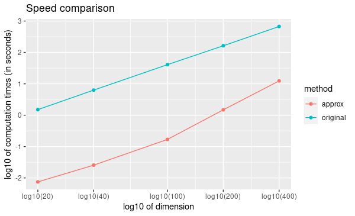

```{r setup, include = FALSE}
options(tinytex.verbose = TRUE)
knitr::opts_chunk$set(
  collapse = TRUE,
  comment = "#>"
)
library(latentcor)
```

# Latent Gaussian Copula Model for Mixed Data

`latentcor` utilizes the powerful semi-parametric latent Gaussian copula models to estimate latent correlations between mixed data types (continuous/binary/ternary/truncated or zero-inflated). Below we review the definitions for each type.

***Definition of continuous model*** [@fan2017high]

A random $X\in\cal{R}^{p}$ satisfies the Gaussian copula (or nonparanormal) model if there exist monotonically increasing $f=(f_{j})_{j=1}^{p}$ with $Z_{j}=f_{j}(X_{j})$ satisfying $Z\sim N_{p}(0, \Sigma)$, $\sigma_{jj}=1$; we denote $X\sim NPN(0, \Sigma, f)$.

```{r continuous}
X = gen_data(n = 6, types = "con")$X
X
```

***Definition of binary model*** [@fan2017high]

A random $X\in\cal{R}^{p}$ satisfies the binary latent Gaussian copula model if there exists $W\sim NPN(0, \Sigma, f)$ such that $X_{j}=I(W_{j}>c_{j})$, where $I(\cdot)$ is the indicator function and $c_{j}$ are constants.

```{r binary}
X = gen_data(n = 6, types = "bin")$X
X
```

***Definition of ternary model*** [@quan2018rank]

A random $X\in\cal{R}^{p}$ satisfies the ternary latent Gaussian copula model if there exists $W\sim NPN(0, \Sigma, f)$ such that $X_{j}=I(W_{j}>c_{j})+I(W_{j}>c'_{j})$, where $I(\cdot)$ is the indicator function and $c_{j}<c'_{j}$ are constants.

```{r ternary}
X = gen_data(n = 6, types = "ter")$X
X
```

***Definition of truncated or zero-inflated model*** [@yoon2020sparse]

A random $X\in\cal{R}^{p}$ satisfies the truncated latent Gaussian copula model if there exists $W\sim NPN(0, \Sigma, f)$ such that $X_{j}=I(W_{j}>c_{j})W_{j}$, where $I(\cdot)$ is the indicator function and $c_{j}$ are constants.

```{r truncated}
X = gen_data(n = 6, types = "tru")$X
X
```


***Mixed latent Gaussian copula model***

The mixed latent Gaussian copula model jointly models $W=(W_{1}, W_{2}, W_{3}, W_{4})\sim NPN(0, \Sigma, f)$ such that $X_{1j}=W_{1j}$, $X_{2j}=I(W_{2j}>c_{2j})$, $X_{3j}=I(W_{3j}>c_{3j})+I(W_{3j}>c'_{3j})$  and $X_{4j}=I(W_{4j}>c_{4j})W_{4j}$.

```{r mixed}
set.seed("234820")
X = gen_data(n = 100, types = c("con", "bin", "ter", "tru"))$X
head(X)
```

# Moment-based estimation of $\Sigma$ based on bridge functions


The estimation of latent correlation matrix $\Sigma$ is achieved via the **bridge function** $F$ which is defined such that $E(\hat{\tau}_{jk})=F(\sigma_{jk})$, where $\sigma_{jk}$ is the latent correlation between variables $j$ and $k$, and $\hat{\tau}_{jk}$ is the corresponding sample Kendall's $\tau$. 


***Kendall's $\tau$ ($\tau_{a}$)***

Given observed $\mathbf{x}_{j}, \mathbf{x}_{k}\in\cal{R}^{n}$,

$$
\hat{\tau}_{jk}=\hat{\tau}(\mathbf{x}_{j}, \mathbf{x}_{k})=\frac{2}{n(n-1)}\sum_{1\le i<i'\le n}sign(x_{ij}-x_{i'j})sign(x_{ik}-x_{i'k}),
$$
where $n$ is the sample size.

`latentcor` calculates pairwise Kendall's $\widehat \tau$ as part of the estimation process

```{r KendallTau}
estimate = latentcor(X, types = c("con", "bin", "ter", "tru"))
K = estimate$K
K
```

Using $F$ and $\widehat \tau_{jk}$, a moment-based estimator is $\hat{\sigma}_{jk}=F^{-1}(\hat{\tau}_{jk})$ with the corresponding  $\hat{\Sigma}$ being consistent for $\Sigma$ [@fan2017high; @quan2018rank; @yoon2020sparse]. 


The explicit form of **bridge function** $F$ has been derived for all combinations of continuous(C)/binary(B)/ternary(N)/truncated(T) variable types, and we summarize the corresponding references. Each of this combinations is implemented in `latentcor`.

|Type | continuous | binary | ternary | zero-inflated (truncated) |
|-----|----------|----------|----------|----------|
|continuous | @liu2009nonparanormal |- | -| - |
|binary | @fan2017high | @fan2017high | - | - |
|ternary | @quan2018rank | @quan2018rank | @quan2018rank | - |
|zero-inflated (truncated) | @yoon2020sparse | @yoon2020sparse | See Appendix | @yoon2020sparse |

Below we provide an explicit form of $F$ for each combination.

**Theorem (explicit form of bridge function)** Let $W_{1}\in\cal{R}^{p_{1}}$, $W_{2}\in\cal{R}^{p_{2}}$, $W_{3}\in\cal{R}^{p_{3}}$, $W_{4}\in\cal{R}^{p_{4}}$ be such that $W=(W_{1}, W_{2}, W_{3}, W_{4})\sim NPN(0, \Sigma, f)$ with $p=p_{1}+p_{2}+p_{3}+p_{4}$. Let $X=(X_{1}, X_{2}, X_{3}, X_{4})\in\cal{R}^{p}$ satisfy $X_{j}=W_{j}$ for $j=1,...,p_{1}$, $X_{j}=I(W_{j}>c_{j})$ for $j=p_{1}+1, ..., p_{1}+p_{2}$, $X_{j}=I(W_{j}>c_{j})+I(W_{j}>c'_{j})$ for $j=p_{1}+p_{2}+1, ..., p_{3}$ and $X_{j}=I(W_{j}>c_{j})W_{j}$ for $j=p_{1}+p_{2}+p_{3}+1, ..., p$ with $\Delta_{j}=f(c_{j})$. The rank-based estimator of $\Sigma$ based on the observed $n$ realizations of $X$ is the matrix $\mathbf{\hat{R}}$ with $\hat{r}_{jj}=1$, $\hat{r}_{jk}=\hat{r}_{kj}=F^{-1}(\hat{\tau}_{jk})$ with block structure

$$
\mathbf{\hat{R}}=\begin{pmatrix}
F_{CC}^{-1}(\hat{\tau}) & F_{CB}^{-1}(\hat{\tau}) & F_{CN}^{-1}(\hat{\tau}) & F_{CT}^{-1}(\hat{\tau})\\
F_{BC}^{-1}(\hat{\tau}) & F_{BB}^{-1}(\hat{\tau}) & F_{BN}^{-1}(\hat{\tau}) & F_{BT}^{-1}(\hat{\tau})\\
F_{NC}^{-1}(\hat{\tau}) & F_{NB}^{-1}(\hat{\tau}) & F_{NN}^{-1}(\hat{\tau}) & F_{NT}^{-1}(\hat{\tau})\\
F_{TC}^{-1}(\hat{\tau}) & F_{TB}^{-1}(\hat{\tau}) & F_{TN}^{-1}(\hat{\tau}) & F_{TT}^{-1}(\hat{\tau})
\end{pmatrix}
$$
$$
F(\cdot)=\begin{cases}
CC:\ 2\sin^{-1}(r)/\pi \\
\\
BC: \ 4\Phi_{2}(\Delta_{j},0;r/\sqrt{2})-2\Phi(\Delta_{j}) \\
\\
BB: \ 2\{\Phi_{2}(\Delta_{j},\Delta_{k};r)-\Phi(\Delta_{j})\Phi(\Delta_{k})\}  \\
\\
NC: \ 4\Phi_{2}(\Delta_{j}^{2},0;r/\sqrt{2})-2\Phi(\Delta_{j}^{2})+4\Phi_{3}(\Delta_{j}^{1},\Delta_{j}^{2},0;\Sigma_{3a}(r))-2\Phi(\Delta_{j}^{1})\Phi(\Delta_{j}^{2})\\
\\
NB: \ 2\Phi_{2}(\Delta_{j}^{2},\Delta_{k},r)\{1-\Phi(\Delta_{j}^{1})\}-2\Phi(\Delta_{j}^{2})\{\Phi(\Delta_{k})-\Phi_{2}(\Delta_{j}^{1},\Delta_{k},r)\} \\
\\
NN: \ 2\Phi_{2}(\Delta_{j}^{2},\Delta_{k}^{2};r)\Phi_{2}(-\Delta_{j}^{1},-\Delta_{k}^{1};r)-2\{\Phi(\Delta_{j}^{2})-\Phi_{2}(\Delta_{j}^{2},\Delta_{k}^{1};r)\}\{\Phi(\Delta_{k}^{2})-\Phi_{2}(\Delta_{j}^{1},\Delta_{k}^{2};r)\} \\
\\
TC: \ -2\Phi_{2}(-\Delta_{j},0;1/\sqrt{2})+4\Phi_{3}(-\Delta_{j},0,0;\Sigma_{3b}(r)) \\
\\
TB: \ 2\{1-\Phi(\Delta_{j})\}\Phi(\Delta_{k})-2\Phi_{3}(-\Delta_{j},\Delta_{k},0;\Sigma_{3c}(r))-2\Phi_{3}(-\Delta_{j},\Delta_{k},0;\Sigma_{3d}(r))  \\
\\
TN: \ -2\Phi(-\Delta_{k}^{1})\Phi(\Delta_{k}^{2}) + 2\Phi_{3}(-\Delta_{k}^{1},\Delta_{k}^{2},\Delta_{j};\Sigma_{3e}(r))+2\Phi_{4}(-\Delta_{k}^{1},\Delta_{k}^{2},-\Delta_{j},0;\Sigma_{4a}(r))+2\Phi_{4}(-\Delta_{k}^{1},\Delta_{k}^{2},-\Delta_{j},0;\Sigma_{4b}(r)) \\
\\
TT: \ -2\Phi_{4}(-\Delta_{j},-\Delta_{k},0,0;\Sigma_{4c}(r))+2\Phi_{4}(-\Delta_{j},-\Delta_{k},0,0;\Sigma_{4d}(r)) \\
\end{cases}
$$

where $\Delta_{j}=\Phi^{-1}(\pi_{0j})$, $\Delta_{k}=\Phi^{-1}(\pi_{0k})$, $\Delta_{j}^{1}=\Phi^{-1}(\pi_{0j})$, $\Delta_{j}^{2}=\Phi^{-1}(\pi_{0j}+\pi_{1j})$, $\Delta_{k}^{1}=\Phi^{-1}(\pi_{0k})$, $\Delta_{k}^{2}=\Phi^{-1}(\pi_{0k}+\pi_{1k})$,

$$
\Sigma_{3a}(r)=
\begin{pmatrix}
1 & 0 & \frac{r}{\sqrt{2}} \\
0 & 1 & -\frac{r}{\sqrt{2}} \\
\frac{r}{\sqrt{2}} & -\frac{r}{\sqrt{2}} & 1
\end{pmatrix}, \;\;\;
\Sigma_{3b}(r)=
\begin{pmatrix}
1 & \frac{1}{\sqrt{2}} & \frac{r}{\sqrt{2}}\\
\frac{1}{\sqrt{2}} & 1 & r \\
\frac{r}{\sqrt{2}} & r & 1
\end{pmatrix}, \;\;\;
\Sigma_{3c}(r)=
\begin{pmatrix}
1 & -r & \frac{1}{\sqrt{2}} \\
-r & 1 & -\frac{r}{\sqrt{2}} \\
\frac{1}{\sqrt{2}} & -\frac{r}{\sqrt{2}} & 1
\end{pmatrix},
$$

$$
\Sigma_{3d}(r)=
\begin{pmatrix}
1 & 0 & -\frac{1}{\sqrt{2}} \\
0 & 1 & -\frac{r}{\sqrt{2}} \\
-\frac{1}{\sqrt{2}} & -\frac{r}{\sqrt{2}} & 1
\end{pmatrix}, \;\;\;
\Sigma_{3e}(r)=
\begin{pmatrix}
1 & 0 & 0 \\
0 & 1 & r \\
0 & r & 1
\end{pmatrix},  \;\;\;
\Sigma_{4a}(r)=
\begin{pmatrix}
1 & 0 & 0 & \frac{r}{\sqrt{2}} \\
0 & 1 & -r & \frac{r}{\sqrt{2}} \\
0 & -r & 1 & -\frac{1}{\sqrt{2}} \\
\frac{r}{\sqrt{2}} & \frac{r}{\sqrt{2}} & -\frac{1}{\sqrt{2}} & 1
\end{pmatrix},
$$

$$
\Sigma_{4b}(r)=
\begin{pmatrix}
1 & 0 & r & \frac{r}{\sqrt{2}} \\
0 & 1 & 0 & \frac{r}{\sqrt{2}} \\
r & 0 & 1 & \frac{1}{\sqrt{2}} \\
\frac{r}{\sqrt{2}} & \frac{r}{\sqrt{2}} & \frac{1}{\sqrt{2}} & 1
\end{pmatrix}, \;\;\;
\Sigma_{4c}(r)=
\begin{pmatrix}
1 & 0 & \frac{1}{\sqrt{2}} & -\frac{r}{\sqrt{2}} \\
0 & 1 & -\frac{r}{\sqrt{2}} & \frac{1}{\sqrt{2}} \\
\frac{1}{\sqrt{2}} & -\frac{r}{\sqrt{2}} & 1 & -r \\
-\frac{r}{\sqrt{2}} & \frac{1}{\sqrt{2}} & -r & 1
\end{pmatrix}\;\;\text{and}\;\;
\Sigma_{4d}(r)=
\begin{pmatrix}
1 & r & \frac{1}{\sqrt{2}} & \frac{r}{\sqrt{2}} \\
r & 1 & \frac{r}{\sqrt{2}} & \frac{1}{\sqrt{2}} \\
\frac{1}{\sqrt{2}} & \frac{r}{\sqrt{2}} & 1 & r \\
\frac{r}{\sqrt{2}} & \frac{1}{\sqrt{2}} & r & 1
\end{pmatrix}.
$$


# Estimation methods

Given the form of bridge function $F$, obtaining a moment-based estimation $\widehat \sigma_{jk}$ requires inversion of $F$. `latentcor` implements two methods for calculation of the inversion:

  * `method = "original"` [Subsection describing original method and relevant parameter `tol`](#original)
  * `method = "approx"` [Subsection describing approximation method and relevant parameter `ratio`](#approx)
  
Both methods calculate inverse bridge function applied to each element of sample Kendall's $\tau$ matrix. Because the calculation is performed point-wise (separately for each pair of variables), the resulting point-wise estimator of correlation matrix may not be positive semi-definite. `latentcor` performs projection of the pointwise-estimator to the space of positive semi-definite matrices, and allows for shrinkage towards identity matrix using the parameter `nu` (see [Subsection describing adjustment of point-wise estimator and relevant parameter `nu`](#shrinkage)).

## Original method (`method = "original"`) {#original }

Original estimation approach relies on numerical inversion of $F$ based on solving uni-root optimization problem. Given the calculated $\widehat \tau_{jk}$ (sample Kendall's $\tau$ between variables $j$ and $k$), the estimate of latent correlation $\widehat \sigma_{jk}$ is obtained by calling `optimize` function to solve the following optimization problem:
$$
\widehat r_{jk} = \arg\min_{r} \{F(r) - \widehat \tau_{jk}\}^2.
$$
The parameter `tol` controls the desired accuracy of the minimizer and is passed to `optimize`, with the default precision of 1e-8:

```{r callR, warning = FALSE, message = F}
estimate = latentcor(X, types = c("con", "bin", "ter", "tru"), method = "original", tol = 1e-8)
```

***Algorithm for Original method***

**Input**: $F(r)=F(r, \mathbf{\Delta})$ - bridge function based on the type of variables $j$, $k$

   - Step 1. Calculate $\hat{\tau}_{jk}$ using (1).
   
```{r kendall}
estimate$K
```
   
   - Step 2. For binary/truncated variable $j$, set $\hat{\mathbf{\Delta}}_{j}=\hat{\Delta}_{j}=\Phi^{-1}(\pi_{0j})$ with $\pi_{0j}=\sum_{i=1}^{n}\frac{I(x_{ij}=0)}{n}$. For ternary variable $j$, set $\hat{\mathbf{\Delta}}_{j}=(\hat{\Delta}_{j}^{1}, \hat{\Delta}_{j}^{2})$ where $\hat{\Delta}_{j}^{1}=\Phi^{-1}(\pi_{0j})$ and $\hat{\Delta}_{j}^{2}=\Phi^{-1}(\pi_{0j}+\pi_{1j})$ with $\pi_{0j}=\sum_{i=1}^{n}\frac{I(x_{ij}=0)}{n}$ and $\pi_{1j}=\sum_{i=1}^{n}\frac{I(x_{ij}=1)}{n}$.
   
```{r zratios_2}
estimate$zratios
```
   
   - Compute $F^{-1}(\hat{\tau}_{jk})$ as $\hat{r}_{jk}=argmin\{F(r)-\hat{\tau}_{jk}\}^{2}$ solved via `optimize` function in *R* with accuracy `tol`.

```{r estimate2}
estimate$Rpointwise
```


## Approximation method (`method = "approx"`) {#approx}

A faster approximation method is based on multi-linear interpolation of pre-computed inverse bridge function on a fixed grid of points [@yoon2021fast]. This is possible as the inverse bridge function is an analytic function of at most 5 parameters:

  - Kendall's $\tau$
  - Proportion of zeros in the 1st variable 
  - (Possibly) proportion of zeros and ones in the 1st variable
  - (Possibly) proportion of zeros in the 2nd variable
  - (Possibly) proportion of zeros and ones in the 2nd variable


In short, d-dimensional multi-linear interpolation uses a weighted average of $2^{d}$ neighbors to approximate the function values at the points within the d-dimensional cube of the neighbors, and to perform interpolation, `latentcor` takes advantage of the R package `chebpol` [@R-chebpol]. This approximation method has been first described in [@yoon2021fast] for continuous/binary/truncated cases. In `latentcor`, we additionally implement ternary case, and optimize the choice of grid as well as interpolation boundary for faster computations with smaller memory footprint.


```{r callR2, warning = FALSE, message = F}
#estimate = latentcor(X, types = c("con", "bin", "ter", "tru"), method = "approx")
```


***Algorithm for Approximation method *** 

**Input**: Let $\check{g}=h(g)$, pre-computed values $F^{-1}(h^{-1}(\check{g}))$ on a fixed grid $\check{g}\in\check{\cal{G}}$ based on the type of variables $j$ and $k$. For binary/continuous case, $\check{g}=(\check{\tau}_{jk}, \check{\Delta}_{j})$; for binary/binary case, $\check{g}=(\check{\tau}_{jk}, \check{\Delta}_{j}, \check{\Delta}_{k})$; for truncated/continuous case, $\check{g}=(\check{\tau}_{jk}, \check{\Delta}_{j})$; for truncated/truncated case, $\check{g}=(\check{\tau}_{jk}, \check{\Delta}_{j}, \check{\Delta}_{k})$; for ternary/continuous case, $\check{g}=(\check{\tau}_{jk}, \check{\Delta}_{j}^{1}, \check{\Delta}_{j}^{2})$; for ternary/binary case, $\check{g}=(\check{\tau}_{jk}, \check{\Delta}_{j}^{1}, \check{\Delta}_{j}^{2}, \check{\Delta}_{k})$; for ternary/truncated case, $\check{g}=(\check{\tau}_{jk}, \check{\Delta}_{j}^{1}, \check{\Delta}_{j}^{2}, \check{\Delta}_{k})$; for ternay/ternary case, $\check{g}=(\check{\tau}_{jk}, \check{\Delta}_{j}^{1}, \check{\Delta}_{j}^{2}, \check{\Delta}_{k}^{1}, \check{\Delta}_{k}^{2})$.

  - Step 1 and Step 2 same as Original method.
  
  - Step 3. If $|\hat{\tau}_{jk}|\le \mbox{ratio}\times \bar{\tau}_{jk}(\cdot)$, apply interpolation; otherwise apply Original method.


To avoid interpolation in areas with high approximation errors close to the boundary, we use hybrid scheme in Step 3. The parameter `ratio` controls the size of the region where the interpolation is performed (`ratio = 0` means no interpolation, `ratio = 1` means interpolation is always performed). For the derivation of approximate bound for BC, BB, TC, TB, TT cases see @yoon2021fast. The derivation of approximate bound for NC, NB, NN, NT case is in the Appendix.

$$
\bar{\tau}_{jk}(\cdot)=
\begin{cases}
2\pi_{0j}(1-\pi_{0j})  &   for \; BC \; case\\
2\min(\pi_{0j},\pi_{0k})\{1-\max(\pi_{0j}, \pi_{0k})\}  &   for \; BB \; case\\
2\{\pi_{0j}(1-\pi_{0j})+\pi_{1j}(1-\pi_{0j}-\pi_{1j})\}  &   for \; NC \; case\\
2\min(\pi_{0j}(1-\pi_{0j})+\pi_{1j}(1-\pi_{0j}-\pi_{1j}),\pi_{0k}(1-\pi_{0k}))  &   for \; NB \; case\\
2\min(\pi_{0j}(1-\pi_{0j})+\pi_{1j}(1-\pi_{0j}-\pi_{1j}), \\
\;\;\;\;\;\;\;\;\;\;\pi_{0k}(1-\pi_{0k})+\pi_{1k}(1-\pi_{0k}-\pi_{1k}))  &   for \; NN \; case\\
1-(\pi_{0j})^{2}  &   for \; TC \; case\\
2\max(\pi_{0k},1-\pi_{0k})\{1-\max(\pi_{0k},1-\pi_{0k},\pi_{0j})\}  &   for \; TB \; case\\
1-\{\max(\pi_{0j},\pi_{0k},\pi_{1k},1-\pi_{0k}-\pi_{1k})\}^{2}  &   for \; TN \; case\\
1-\{\max(\pi_{0j},\pi_{0k})\}^{2}  &   for \; TT \; case\\
\end{cases}
$$

By default, `latentcor` uses `ratio = 0.9` as this value was recommended in @yoon2021fast having a good balance of accuracy and computational speed. This value, however, can be modified by the user.

```{r estimate3, warning = FALSE, message = F}
#latentcor(X, types = c("con", "bin", "ter", "tru"), method = "approx", ratio = 0.99)$R
#latentcor(X, types = c("con", "bin", "ter", "tru"), method = "approx", ratio = 0.4)$R
latentcor(X, types = c("con", "bin", "ter", "tru"), method = "original")$R
```

The lower is the `ratio`, the closer is the approximation method to original method (with `ratio = 0` being equivalent to `method = "original"`), but also the higher is the cost of computations.

```{r speed, warning = FALSE, message = F}
library(microbenchmark)
#microbenchmark(latentcor(X, types = c("con", "bin", "ter", "tru"), method = "approx", ratio = 0.99)$R)
#microbenchmark(latentcor(X, types = c("con", "bin", "ter", "tru"), method = "approx", ratio = 0.4)$R)
microbenchmark(latentcor(X, types = c("con", "bin", "ter", "tru"), method = "original")$R)
```

**Rescaled Grid for Interpolation**

Since $|\hat{\tau}|\le \bar{\tau}$, the grid does not need to cover the whole domain $\tau\in[-1, 1]$. To optimize memory associated with storing the grid, we rescale $\tau$ as follows:
$\check{\tau}_{jk}=\tau_{jk}/\bar{\tau}_{jk}\in[-1, 1]$, where $\bar{\tau}_{jk}$ is as defined above. 

In addition, for ternary variable $j$, it always holds that $\Delta_{j}^{2}>\Delta_{j}^{1}$ since $\Delta_{j}^{1}=\Phi^{-1}(\pi_{0j})$ and $\Delta_{j}^{2}=\Phi^{-1}(\pi_{0j}+\pi_{1j})$. Thus, the grid should not cover the the area corresponding to $\Delta_{j}^{2}\le\Delta_{j}^{1}$. We thus rescale as follows: $\check{\Delta}_{j}^{1}=\Delta_{j}^{1}/\Delta_{j}^{2}\in[0, 1]$; $\check{\Delta}_{j}^{2}=\Delta_{j}^{2}\in[0, 1]$.

**Speed Comparison**

To illustrate the speed improvement by `method = "approx"`, we plot the run time scaling behavior of `method = "approx"` and `method = "original"` (setting `types` for `gen_data` by replicating `c("con", "bin", "ter", "tru")` multiple times) with increasing dimensions $p = [20, 40, 100, 200, 400]$ at sample size $n = 100$ using simulation data. Figure below summarizes the observed scaling in a log-log plot. For both methods we observe the expected $O(p^2)$ scaling
behavior with dimension p, i.e., a linear scaling in the log-log plot. However, `method = "approx"` is at least one order of magnitude faster than `method = "original"` independent of the dimension of the problem.



## Adjustment of pointwise-estimator for positive-definiteness {#shrinkage}

Since the estimation is performed point-wise, the resulting matrix of estimated latent correlations is not guaranteed to be positive semi-definite. For example, this could be expected when the sample size is small (and so the estimation error for each pairwise correlation is larger)

```{r, message = FALSE}
set.seed("234820")
X = gen_data(n = 6, types = c("con", "bin", "ter", "tru"))$X
X
out = latentcor(X, types = c("con", "bin", "ter", "tru"))
out$Rpointwise
eigen(out$Rpointwise)$values
```

`latentcor` automatically corrects the pointwise estimator to be positive definite by making two adjustments. First, if `Rpointwise` has smallest eigenvalue less than zero, the `latentcor` projects this matrix to the nearest positive semi-definite matrix. The user is notified of this adjustment through the message (supressed in previous code chunk), e.g.
```{r, message = TRUE}
out = latentcor(X, types = c("con", "bin", "ter", "tru"))
```

Second, `latentcor` shrinks the adjusted matrix of correlations towards identity matrix using the parameter $\nu$ with default value of 0.001 (`nu = 0.001`), so that the resulting `R` is strictly positive definite with the minimal eigenvalue being greater or equal to $\nu$. That is
$$
R = (1 - \nu) \widetilde R + \nu I,
$$
where $\widetilde R$ is the nearest positive semi-definite matrix to `Rpointwise`. 
```{r}
out = latentcor(X, types = c("con", "bin", "ter", "tru"), nu = 0.001)
out$Rpointwise
out$R
```
As a result, `R` and `Rpointwise` could be quite different when sample size $n$ is small. When $n$ is large and $p$ is moderate, the difference is typically driven by parameter `nu`.

```{r}
set.seed("234820")
X = gen_data(n = 100, types = c("con", "bin", "ter", "tru"))$X
out = latentcor(X, types = c("con", "bin", "ter", "tru"), nu = 0.001)
out$Rpointwise
out$R
```

# Appendix

## Derivation of bridge function $F$ for ternary/truncated case

Without loss of generality, let $j=1$ and $k=2$. By the definition of Kendall's $\tau$,
$$
    \tau_{12}=E(\hat{\tau}_{12})=E[\frac{2}{n(n-1)}\sum_{1\leq i\leq i' \leq n} sign\{(X_{i1}-X_{i'1})(X_{i2}-X_{i'2})\}].
$$
Since $X_{1}$ is ternary,
\begin{align}
    &sign(X_{1}-X_{1}') \nonumber\\ =&[I(U_{1}>C_{11},U_{1}'\leq C_{11})+I(U_{1}>C_{12},U_{1}'\leq C_{12})-I(U_{1}>C_{12},U_{1}'\leq C_{11})] \nonumber\\
    &-[I(U_{1}\leq C_{11}, U_{1}'>C_{11})+I(U_{1}\leq C_{12}, U_{1}'>C_{12})-I(U_{1}\leq C_{11}, U_{1}'>C_{12})] \nonumber\\
    =&[I(U_{1}>C_{11})-I(U_{1}>C_{11},U_{1}'>C_{11})+I(U_{1}>C_{12})-I(U_{1}>C_{12},U_{1}'>C_{12}) \nonumber\\
    &-I(U_{1}>C_{12})+I(U_{1}>C_{12},U_{1}'>C_{11})] \nonumber\\
    &-[I(U_{1}'>C_{11})-I(U_{1}>C_{11},U_{1}'>C_{11})+I(U_{1}'>C_{12})-I(U_{1}>C_{12},U_{1}'>C_{12}) \nonumber\\
    &-I(U_{1}'>C_{12})+I(U_{1}>C_{11},U_{1}'>C_{12})] \nonumber\\
    =&I(U_{1}>C_{11})+I(U_{1}>C_{12},U_{1}'>C_{11})-I(U_{1}'>C_{11})-I(U_{1}>C_{11},U_{1}'>C_{12}) \nonumber\\
    =&I(U_{1}>C_{11},U_{1}'\leq C_{12})-I(U_{1}'>C_{11},U_{1}\leq C_{12}).
\end{align}
Since $X_{2}$ is truncated, $C_{1}>0$ and
\begin{align}
    sign(X_{2}-X_{2}')=&-I(X_{2}=0,X_{2}'>0)+I(X_{2}>0,X_{2}'=0) \nonumber\\
    &+I(X_{2}>0,X_{2}'>0)sign(X_{2}-X_{2}') \nonumber\\
    =&-I(X_{2}=0)+I(X_{2}'=0)+I(X_{2}>0,X_{2}'>0)sign(X_{2}-X_{2}').
\end{align}
Since $f$ is monotonically increasing, $sign(X_{2}-X_{2}')=sign(Z_{2}-Z_{2}')$,
\begin{align}
    \tau_{12}=&E[I(U_{1}>C_{11},U_{1}'\leq C_{12}) sign(X_{2}-X_{2}')] \nonumber\\ &-E[I(U_{1}'>C_{11},U_{1}\leq C_{12}) sign(X_{2}-X_{2}')] \nonumber\\
    =&-E[I(U_{1}>C_{11},U_{1}'\leq C_{12}) I(X_{2}=0)] \nonumber\\
    &+E[I(U_{1}>C_{11},U_{1}'\leq C_{12}) I(X_{2}'=0)] \nonumber\\
    &+E[I(U_{1}>C_{11},U_{1}'\leq C_{12})I(X_{2}>0,X_{2}'>0)sign(Z_{2}-Z_{2}')] \nonumber\\
    &+E[I(U_{1}'>C_{11},U_{1}\leq C_{12}) I(X_{2}=0)] \nonumber\\
    &-E[I(U_{1}'>C_{11},U_{1}\leq C_{12}) I(X_{2}'=0)] \nonumber\\
    &-E[I(U_{1}'>C_{11},U_{1}\leq C_{12})I(X_{2}>0,X_{2}'>0)sign(Z_{2}-Z_{2}')]  \nonumber\\
    =&-2E[I(U_{1}>C_{11},U_{1}'\leq C_{12}) I(X_{2}=0)] \nonumber\\
    &+2E[I(U_{1}>C_{11},U_{1}'\leq C_{12}) I(X_{2}'=0)] \nonumber\\
    &+E[I(U_{1}>C_{11},U_{1}'\leq C_{12})I(X_{2}>0,X_{2}'>0)sign(Z_{2}-Z_{2}')] \nonumber\\
    &-E[I(U_{1}'>C_{11},U_{1}\leq C_{12})I(X_{2}>0,X_{2}'>0)sign(Z_{2}-Z_{2}')].
\end{align}
From the definition of $U$, let $Z_{j}=f_{j}(U_{j})$ and $\Delta_{j}=f_{j}(C_{j})$ for $j=1,2$. Using $sign(x)=2I(x>0)-1$, we obtain
\begin{align}
    \tau_{12}=&-2E[I(Z_{1}>\Delta_{11},Z_{1}'\leq \Delta_{12},Z_{2}\leq \Delta_{2})]+2E[I(Z_{1}>\Delta_{11},Z_{1}'\leq \Delta_{12},Z_{2}'\leq \Delta_{2})] \nonumber\\
    &+2E[I(Z_{1}>\Delta_{11},Z_{1}'\leq \Delta_{12})I(Z_{2}>\Delta_{2},Z_{2}'>\Delta_{2},Z_{2}-Z_{2}'>0)] \nonumber\\
    &-2E[I(Z_{1}'>\Delta_{11},Z_{1}\leq \Delta_{12})I(Z_{2}>\Delta_{2},Z_{2}'>\Delta_{2},Z_{2}-Z_{2}'>0)] \nonumber\\
    =&-2E[I(Z_{1}>\Delta_{11},Z_{1}'\leq \Delta_{12}, Z_{2}\leq \Delta_{2})]+2E[I(Z_{1}>\Delta_{11},Z_{1}'\leq \Delta_{12}, Z_{2}'\leq \Delta_{2})] \nonumber\\
    &+2E[I(Z_{1}>\Delta_{11},Z_{1}'\leq\Delta_{12},Z_{2}'>\Delta_{2},Z_{2}>Z_{2}')] \nonumber\\
    &-2E[I(Z_{1}'>\Delta_{11},Z_{1}\leq\Delta_{12},Z_{2}'>\Delta_{2},Z_{2}>Z_{2}')].
\end{align}
Since $\{\frac{Z_{2}'-Z_{2}}{\sqrt{2}}, -Z{1}\}$, $\{\frac{Z_{2}'-Z_{2}}{\sqrt{2}}, Z{1}'\}$ and $\{\frac{Z_{2}'-Z_{2}}{\sqrt{2}}, -Z{2}'\}$ are standard bivariate normally distributed variables with correlation $-\frac{1}{\sqrt{2}}$, $r/\sqrt{2}$ and $-\frac{r}{\sqrt{2}}$, respectively, by the definition of $\Phi_3(\cdot,\cdot, \cdot;\cdot)$ and $\Phi_4(\cdot,\cdot, \cdot,\cdot;\cdot)$ we have
\begin{align}
    F_{NT}(r;\Delta_{j}^{1},\Delta_{j}^{2},\Delta_{k})= & -2\Phi_{3}\left\{-\Delta_{j}^{1},\Delta_{j}^{2},\Delta_{k};\begin{pmatrix}
1 & 0 & -r \\
0 & 1 & 0 \\
-r & 0 & 1
\end{pmatrix} \right\} \nonumber\\
    &+2\Phi_{3}\left\{-\Delta_{j}^{1},\Delta_{j}^{2},\Delta_{k};\begin{pmatrix}
1 & 0 & 0 \\
0 & 1 & r \\
0 & r & 1
\end{pmatrix}\right\}\nonumber \\
    & +2\Phi_{4}\left\{-\Delta_{j}^{1},\Delta_{j}^{2},-\Delta_{k},0;\begin{pmatrix}
1 & 0 & 0 & \frac{r}{\sqrt{2}} \\
0 & 1 & -r & \frac{r}{\sqrt{2}} \\
0 & -r & 1 & -\frac{1}{\sqrt{2}} \\
\frac{r}{\sqrt{2}} & \frac{r}{\sqrt{2}} & -\frac{1}{\sqrt{2}} & 1
\end{pmatrix}\right\} \nonumber\\
    &-2\Phi_{4}\left\{-\Delta_{j}^{1},\Delta_{j}^{2},-\Delta_{k},0;\begin{pmatrix}
1 & 0 & r & -\frac{r}{\sqrt{2}} \\
0 & 1 & 0 & -\frac{r}{\sqrt{2}} \\
r & 0 & 1 & -\frac{1}{\sqrt{2}} \\
-\frac{r}{\sqrt{2}} & -\frac{r}{\sqrt{2}} & -\frac{1}{\sqrt{2}} & 1
\end{pmatrix}\right\}.
\end{align}
Using the facts that
\begin{align}
&\Phi_{4}\left\{-\Delta_{j}^{1},\Delta_{j}^{2},-\Delta_{k},0;\begin{pmatrix}
1 & 0 & r & -\frac{r}{\sqrt{2}} \\
0 & 1 & 0 & -\frac{r}{\sqrt{2}} \\
r & 0 & 1 & -\frac{1}{\sqrt{2}} \\
-\frac{r}{\sqrt{2}} & -\frac{r}{\sqrt{2}} & -\frac{1}{\sqrt{2}} & 1
\end{pmatrix}\right\} \nonumber\\ &+\Phi_{4}\left\{-\Delta_{j}^{1},\Delta_{j}^{2},-\Delta_{k},0;\begin{pmatrix}
1 & 0 & r & \frac{r}{\sqrt{2}} \\
0 & 1 & 0 & \frac{r}{\sqrt{2}} \\
r & 0 & 1 & \frac{1}{\sqrt{2}} \\
\frac{r}{\sqrt{2}} & \frac{r}{\sqrt{2}} & \frac{1}{\sqrt{2}} & 1
\end{pmatrix}\right\} \nonumber\\
=&\Phi_{3}\left\{-\Delta_{j}^{1},\Delta_{j}^{2},-\Delta_{k};\begin{pmatrix}
1 & 0 & 0 \\
0 & 1 & r \\
0 & r & 1
\end{pmatrix}\right\}
\end{align}
and
\begin{align}
&\Phi_{3}\left\{-\Delta_{j}^{1},\Delta_{j}^{2},-\Delta_{k};\begin{pmatrix}
1 & 0 & 0 \\
0 & 1 & r \\
0 & r & 1
\end{pmatrix}\right\}+\Phi_{3}\left\{-\Delta_{j}^{1},\Delta_{j}^{2},\Delta_{k};\begin{pmatrix}
1 & 0 & -r \\
0 & 1 & 0 \\
-r & 0 & 1
\end{pmatrix} \right\} \nonumber\\
=&\Phi_{2}(-\Delta_{j}^{1},\Delta_{j}^{2};0)
=\Phi(-\Delta_{j}^{1})\Phi(\Delta_{j}^{2}).
\end{align}
So that,
\begin{align}
    F_{NT}(r;\Delta_{j}^{1},\Delta_{j}^{2},\Delta_{k})= & -2\Phi(-\Delta_{j}^{1})\Phi(\Delta_{j}^{2}) \nonumber\\
    &+2\Phi_{3}\left\{-\Delta_{j}^{1},\Delta_{j}^{2},\Delta_{k};\begin{pmatrix}
1 & 0 & 0 \\
0 & 1 & r \\
0 & r & 1
\end{pmatrix}\right\}\nonumber \\
    & +2\Phi_{4}\left\{-\Delta_{j}^{1},\Delta_{j}^{2},-\Delta_{k},0;\begin{pmatrix}
1 & 0 & 0 & \frac{r}{\sqrt{2}} \\
0 & 1 & -r & \frac{r}{\sqrt{2}} \\
0 & -r & 1 & -\frac{1}{\sqrt{2}} \\
\frac{r}{\sqrt{2}} & \frac{r}{\sqrt{2}} & -\frac{1}{\sqrt{2}} & 1
\end{pmatrix}\right\} \nonumber\\
    &+2\Phi_{4}\left\{-\Delta_{j}^{1},\Delta_{j}^{2},-\Delta_{k},0;\begin{pmatrix}
1 & 0 & r & \frac{r}{\sqrt{2}} \\
0 & 1 & 0 & \frac{r}{\sqrt{2}} \\
r & 0 & 1 & \frac{1}{\sqrt{2}} \\
\frac{r}{\sqrt{2}} & \frac{r}{\sqrt{2}} & \frac{1}{\sqrt{2}} & 1
\end{pmatrix}\right\}.
\end{align}

It is easy to get the bridge function for truncated/ternary case by switching $j$ and $k$.

## Derivation of approximate bound for the ternary/continuous case

Let $n_{0x}=\sum_{i=1}^{n_x}I(x_{i}=0)$, $n_{2x}=\sum_{i=1}^{n_x}I(x_{i}=2)$, $\pi_{0x}=\frac{n_{0x}}{n_{x}}$ and $\pi_{2x}=\frac{n_{2x}}{n_{x}}$, then
\begin{align}
    |\tau(\mathbf{x})|\leq & \frac{n_{0x}(n-n_{0x})+n_{2x}(n-n_{0x}-n_{2x})}{\begin{pmatrix} n \\ 2 \end{pmatrix}} \nonumber\\
    = & 2\{\frac{n_{0x}}{n-1}-(\frac{n_{0x}}{n})(\frac{n_{0x}}{n-1})+\frac{n_{2x}}{n-1}-(\frac{n_{2x}}{n})(\frac{n_{0x}}{n-1})-(\frac{n_{2x}}{n})(\frac{n_{2x}}{n-1})\} \nonumber\\
    \approx & 2\{\frac{n_{0x}}{n}-(\frac{n_{0x}}{n})^2+\frac{n_{2x}}{n}-(\frac{n_{2x}}{n})(\frac{n_{0x}}{n})-(\frac{n_{2x}}{n})^2\} \nonumber\\
    = & 2\{\pi_{0x}(1-\pi_{0x})+\pi_{2x}(1-\pi_{0x}-\pi_{2x})\}
\end{align}

For ternary/binary and ternary/ternary cases, we combine the two individual bounds.


## Derivation of approximate bound for the ternary/truncated case

 Let $\mathbf{x}\in\mathcal{R}^{n}$ and $\mathbf{y}\in\mathcal{R}^{n}$ be the observed $n$ realizations of ternary and truncated variables, respectively. Let $n_{0x}=\sum_{i=0}^{n}I(x_{i}=0)$, $\pi_{0x}=\frac{n_{0x}}{n}$, $n_{1x}=\sum_{i=0}^{n}I(x_{i}=1)$, $\pi_{1x}=\frac{n_{1x}}{n}$, $n_{2x}=\sum_{i=0}^{n}I(x_{i}=2)$, $\pi_{2x}=\frac{n_{2x}}{n}$,
$n_{0y}=\sum_{i=0}^{n}I(y_{i}=0)$, $\pi_{0y}=\frac{n_{0y}}{n}$, $n_{0x0y}=\sum_{i=0}^{n}I(x_{i}=0 \;\& \; y_{i}=0)$, $n_{1x0y}=\sum_{i=0}^{n}I(x_{i}=1 \;\& \; y_{i}=0)$ and
$n_{2x0y}=\sum_{i=0}^{n}I(x_{i}=2 \;\& \; y_{i}=0)$ then
\begin{align}
    |\tau(\mathbf{x}, \mathbf{y})|\leq &
    \frac{\begin{pmatrix}n \\ 2\end{pmatrix}-\begin{pmatrix}n_{0x} \\ 2\end{pmatrix}-\begin{pmatrix}n_{1x} \\ 2\end{pmatrix}-\begin{pmatrix} n_{2x} \\ 2 \end{pmatrix}-\begin{pmatrix}n_{0y} \\ 2\end{pmatrix}+\begin{pmatrix}n_{0x0y} \\ 2 \end{pmatrix}+\begin{pmatrix}n_{1x0y} \\ 2\end{pmatrix}+\begin{pmatrix}n_{2x0y} \\ 2\end{pmatrix}}{\begin{pmatrix}n \\ 2\end{pmatrix}} \nonumber
\end{align}
Since $n_{0x0y}\leq\min(n_{0x},n_{0y})$, $n_{1x0y}\leq\min(n_{1x},n_{0y})$ and $n_{2x0y}\leq\min(n_{2x},n_{0y})$ we obtain
\begin{align}
     |\tau(\mathbf{x}, \mathbf{y})|\leq &
    \frac{\begin{pmatrix}n \\ 2\end{pmatrix}-\begin{pmatrix}n_{0x} \\ 2\end{pmatrix}-\begin{pmatrix}n_{1x} \\ 2\end{pmatrix}-\begin{pmatrix} n_{2x} \\ 2 \end{pmatrix}-\begin{pmatrix}n_{0y} \\ 2\end{pmatrix}}{\begin{pmatrix}n \\ 2\end{pmatrix}} \nonumber\\
    & +  \frac{\begin{pmatrix}\min(n_{0x},n_{0y}) \\ 2 \end{pmatrix}+\begin{pmatrix}\min(n_{1x},n_{0y}) \\ 2\end{pmatrix}+\begin{pmatrix}\min(n_{2x},n_{0y}) \\ 2\end{pmatrix}}{\begin{pmatrix}n \\ 2\end{pmatrix}} \nonumber\\
    \leq & \frac{\begin{pmatrix}n \\ 2\end{pmatrix}-\begin{pmatrix}\max(n_{0x},n_{1x},n_{2x},n_{0y}) \\ 2\end{pmatrix}}{\begin{pmatrix}n \\ 2\end{pmatrix}} \nonumber\\
    \leq & 1-\frac{\max(n_{0x},n_{1x},n_{2x},n_{0y})(\max(n_{0x},n_{1x},n_{2x},n_{0y})-1)}{n(n-1)} \nonumber\\
    \approx & 1-(\frac{\max(n_{0x},n_{1x},n_{2x},n_{0y})}{n})^{2} \nonumber\\
    =& 1-\{\max(\pi_{0x},\pi_{1x},\pi_{2x},\pi_{0y})\}^{2} \nonumber\\
    =& 1-\{\max(\pi_{0x},(1-\pi_{0x}-\pi_{2x}),\pi_{2x},\pi_{0y})\}^{2}
\end{align}

It is easy to get the approximate bound for truncated/ternary case by switching $\mathbf{x}$ and $\mathbf{y}$.

# References


